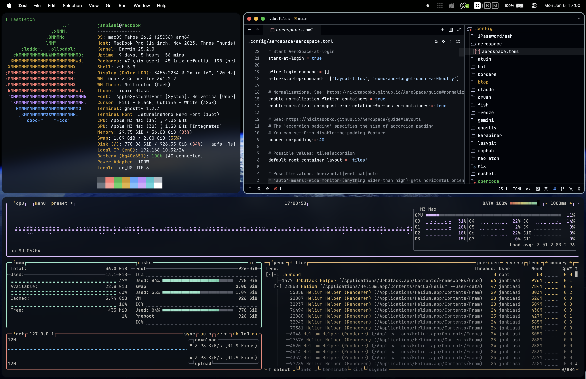

<p align="center">
    
</p>
<p align="center">
    <a href="#requirements">Requirements</a> · <a href="#included-configurations">Included Configurations</a> · <a href="#installation">Installation</a> · <a href="#available-tasks">Tasks</a>
</p>

## Dotfiles

This directory contains the dotfles for my development environment

### Requirements

- [Git](https://git-scm.com/)
- [Stow](https://www.gnu.org/software/stow/)
- [Make](https://www.gnu.org/software/make/)

### Included Configurations

- [1password](https://1password.com)
- [aerospace](https://nikitabobko.github.io/AeroSpace/guide) :apple:
- [atuin](https://atuin.sh/)
- [bat](https://github.com/sharkdp/bat)
- [btop](https://github.com/aristocratos/btop)
- [claude](https://www.claude.com/product/claude-code) 🧠
- [crush](https://github.com/charmbracelet/crush) 🧠
- [devbox](https://www.jetify.com/devbox)
- [ghostty](https://ghostty.org/)
- [freeze](https://github.com/charmbracelet/freeze)
- [jankyborders](https://github.com/FelixKratz/JankyBorders) :apple:
- [karabiner elements](https://karabiner-elements.pqrs.org/) :apple:
- [lazygit](https://github.com/jesseduffield/lazygit)
- [neofetch](https://github.com/dylanaraps/neofetch)
- [nix](https://nixos.org)
- [opencode](https://opencode.ai/) 🧠
- [posting](https://posting.sh/)
- [ripgrep](https://github.com/BurntSushi/ripgrep)
- [sketchybar](https://github.com/FelixKratz/SketchyBar) :apple: _(currently unused)_
- [starship](https://starship.rs)
- [tmux](https://github.com/tmux/tmux)
- [vhs](https://github.com/charmbracelet/vhs)
- [yazi](https://github.com/sxyazi/yazi)
- [zed](https://zed.dev)
- [zen browser](https://zen-browser.app/) :apple: _(currently unused)_
- [zsh](https://www.zsh.org/)

### Installation

#### 1. Install required software

```sh
xcode-select --install
/bin/bash -c "$(curl -fsSL https://raw.githubusercontent.com/Homebrew/install/HEAD/install.sh)"
brew install stow make
```

#### 2. Clone Repository

```sh
git clone https://github.com/janbiasi/.dotfiles.git
cd .dotfiles
```

#### 3. Apply macOS configuration

```sh
make configure-macos
```

#### 4. Install dependencies

##### macOS

```sh
make install-brew
```

##### linux

_not available yet_

#### 5. Apply or update setup configuration

```sh
make install-configs # initially
make install-nvim # clones neovim config (requires install / SSH key via 1password)
make update # apply incremental updates
```

### Available tasks

| Task                           | Description                                                                                                |
| ------------------------------ | ---------------------------------------------------------------------------------------------------------- |
| `install-configs`              | Sync configuration files to the local file system via [stow](https://www.gnu.org/software/stow/)           |
| `update`                       | Convenience method; calls `update-dotfiles` and `update-nvim`                                              |
| `update-nvim`                  | Pull latest changes from nvim.config repository                                                            |
| `update-dotfiles`              | Re-stows all configuration files                                                                           |
| `install-nvim`                 | Installs the nvim configuration from the [nvim.config](https://github.com/janbiasi/nvim.config) repository |
| `install-brew`                 | Installs all required software packages via [homebrew](https://brew.sh/)                                   |
| `configure-env`                | Expands environment secrets from 1Password, see [.env.tpl](./.env.tpl)                                     |
| `configure-macos`              | Applies various macOS configurations, see [.macos](./extra/.macos)                                         |
| `configure-macos-fish-default` | Sets the default shell to fish on macOS                                                                    |
