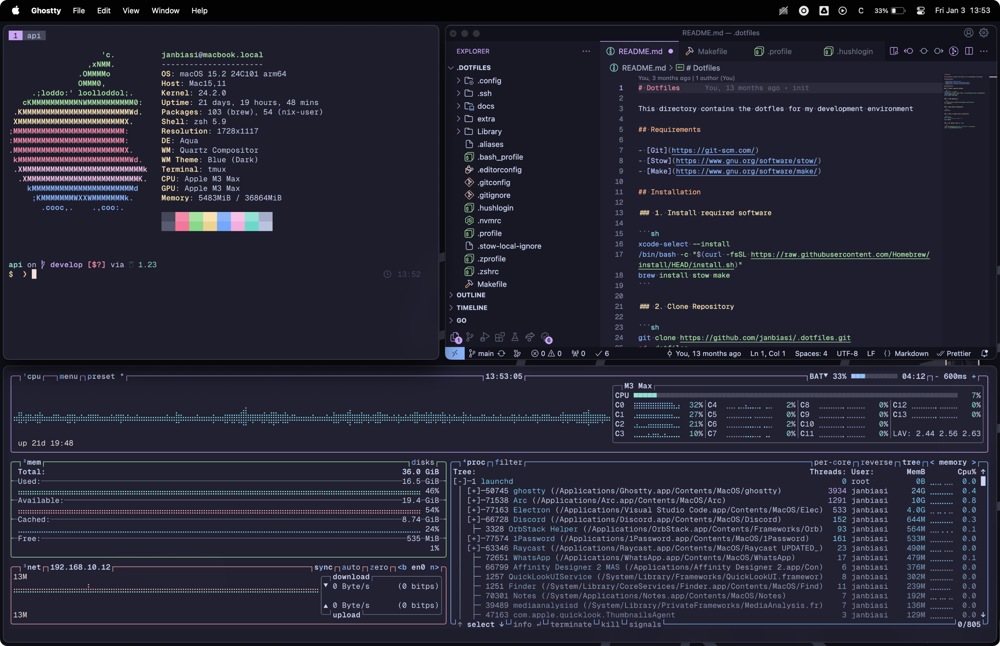

<p align="center">
    
</p>
<p align="center">
    <a href="#requirements">Requirements</a> · <a href="#included-configurations">Included Configurations</a> · <a href="#installation">Installation</a>
</p>

## Dotfiles

This directory contains the dotfles for my development environment

### Requirements

- [Git](https://git-scm.com/)
- [Stow](https://www.gnu.org/software/stow/)
- [Make](https://www.gnu.org/software/make/)

### Included Configurations

- [1password](https://1password.com) :apple: :penguin:
- [aerospace](https://nikitabobko.github.io/AeroSpace/guide) :apple:
- [btop](https://github.com/aristocratos/btop) :apple: :penguin:
- [ghostty](https://ghostty.org/) :apple: :penguin:
- [lazygit](https://github.com/jesseduffield/lazygit) :apple: :penguin:
- [neofetch](https://github.com/dylanaraps/neofetch) :apple: :penguin:
- [nix](https://nixos.org) :apple: :penguin:
- [ripgrep](https://github.com/BurntSushi/ripgrep) :apple: :penguin:
- [sketchybar](https://github.com/FelixKratz/SketchyBar) :apple:
- [starship](https://starship.rs) :apple: :penguin:
- [tmux](https://github.com/tmux/tmux) :apple: :penguin:
- [yazi](https://github.com/sxyazi/yazi) :apple: :penguin:
- [zed](https://zed.dev) :apple: :penguin:

### Installation

#### 1. Install required software

```sh
xcode-select --install
/bin/bash -c "$(curl -fsSL https://raw.githubusercontent.com/Homebrew/install/HEAD/install.sh)"
brew install stow make
```

#### 2. Clone Repository

```sh
git clone https://github.com/janbiasi/.dotfiles.git
cd .dotfiles
```

#### 3. Apply macOS configuration

```sh
make macos
```

#### 4. Apply or update setup configuration

```sh
make install # initially
make nvim # clones neovim config (requires install / SSH key via 1password)
make update # apply incremental updates
```

#### 5. Set default shell to `fish` _(optional)_

```sh
echo /opt/homebrew/bin/fish | sudo tee -a /etc/shells
chsh -s /opt/homebrew/bin/fish
```
